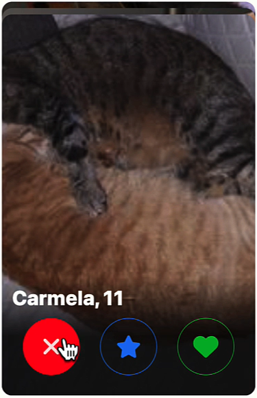
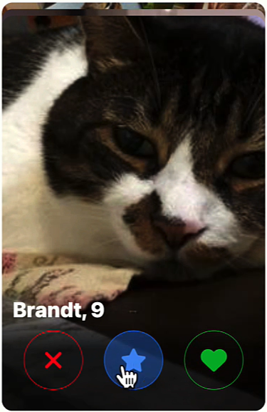
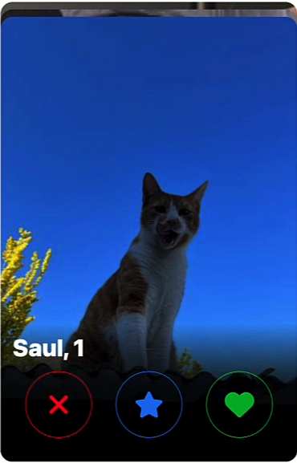

# 🚀 React Learning Journey – Course Projects & Notes

This repository contains all the projects, exercises, and notes I completed while following a React course focused on building modern web applications with **TypeScript** and best practices.

---

## 📌 About This Repository

This is **not a course**, but a collection of:

- 🧪 Practice projects  
- 📚 Personal notes  
- 🛠️ Code experiments  
- ✅ Implementations of course concepts  

The goal of this repo is to document my progress and consolidate my understanding of React and modern frontend development.

---

## 🎯 What I Learned

During this course, I covered:

- ⚛️ Core concepts of React  
- 🧠 React Hooks (from version 16.8+)  
- 🟦 Fundamentals and advanced usage of TypeScript  
- 🏗️ Structuring scalable React applications  
- 🎨 Building reusable UI components with Styled Components  
- ✨ Adding animations with Styled Components  
- 🎯 Creating and managing themes  
- 💡 Writing clean, readable, and reusable code  

---

## 🧠 Key Concepts Practiced

- Component-based architecture  
- State and props management  
- Code reusability and scalability  
- Separation of concerns  
- Type safety with TypeScript  

---

## 🏆 Final Project: Catch (Cat Tinder)
The journey concludes with a comprehensive final project that serves as a synthesis of everything covered in the course. This application demonstrates a full mastery of Component-Based Architecture and Type Safety, featuring a robust UI built entirely with Styled Components. It implements complex state logic, dynamic theme switching, and smooth transitions, showcasing the ability to transform a conceptual design into a production-ready React interface.

  
  
  

---

## 🛠️ Tech Stack

- React  
- TypeScript  
- Styled Components  
- HTML5 / CSS3 / JavaScript (ES6+)  

---

## 📁 Project Organization

The repository is structured to reflect the course progression: each chapter has its own dedicated directory, where I implemented the concepts and exercises covered in that section. 
This approach allowed me to focus on specific topics step by step while keeping the code organized and easy to navigate. 
At the end of the course, I built a **final project** that brings together all the key concepts learned, including React fundamentals, TypeScript usage, component architecture and styling with Styled Components.

---

## 📈 Purpose

This repository serves as:

- A **portfolio of my React learning journey**
- A **reference for future projects**
- A way to track my **growth as a frontend developer**

---

## 🚀 Next Steps

- Build more complex applications  
- Explore state management (Redux, Zustand, etc.)  
- Work with APIs and backend integration  
- Improve performance and testing  

---

## 🙌 Acknowledgments

Thanks to the course instructor for providing a clear and practical introduction to React and modern frontend development.

---

## 📬 Feedback

If you have suggestions or improvements, feel free to open an issue or reach out!

